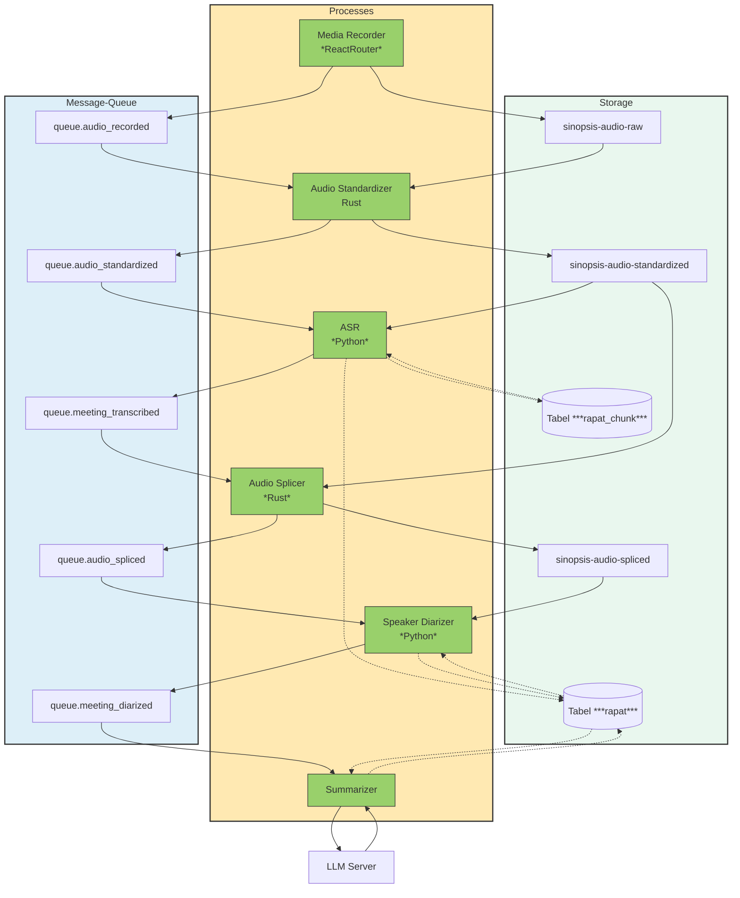
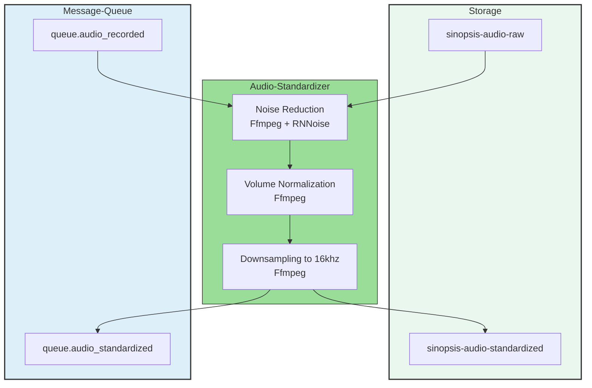
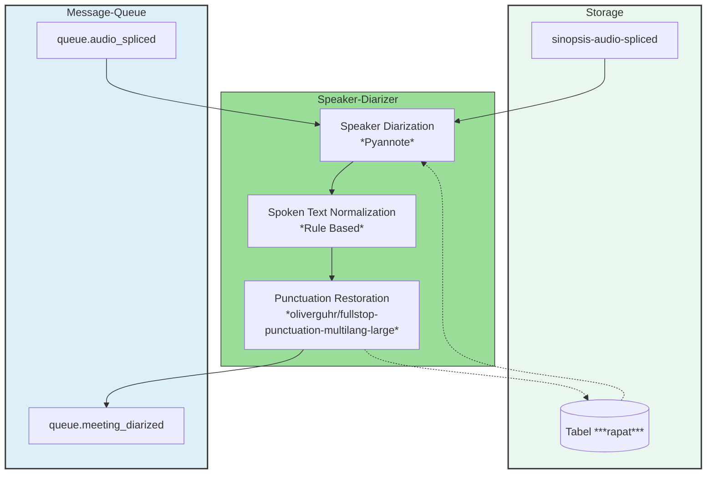

# Alur Pemrosesan Audio

```mermaid
graph TD
    subgraph "Storage"
        Q1[sinopsis-audio-raw];
        Q2[sinopsis-audio-standardized];
        Q3[sinopsis-audio-spliced];
        DB1[(Tabel ***rapat_chunk***)]
        DB2[(Tabel ***rapat***)]
    end

    subgraph "Processes"
        P1[Media Recorder<br>*ReactRouter*];
        style P1 fill:#00aa0066,stroke:#333,stroke-width:1;
        P2[Audio Standardizer<br>Rust];
        style P2 fill:#00aa0066,stroke:#333,stroke-width:1;
        P3[ASR<br>*Python*];
        style P3 fill:#00aa0066,stroke:#333,stroke-width:1;
        P4[Audio Splicer<br>*Rust*];
        style P4 fill:#00aa0066,stroke:#333,stroke-width:1;
        P5[Speaker Diarizer<br>*Python*];
        style P5 fill:#00aa0066,stroke:#333,stroke-width:1;
        P6[Summarizer];
        style P6 fill:#00aa0066,stroke:#333,stroke-width:1;
    end

    subgraph "Message-Queue"
        M1[queue.audio_recorded];
        M2[queue.audio_standardized];
        M3[queue.meeting_transcribed];
        M4[queue.audio_spliced];
        M5[queue.meeting_diarized];
    end
    LLM[LLM Server]

    P1 --> Q1;
    P1 --> M1;
    Q1 --> P2;
    M1 --> P2;
    P2 --> Q2;
    P2 --> M2;
    M2 --> P3;
    Q2 --> P4;
    Q2 --> P3;
    P3 --> M3;
    P3 -.-> DB1;
    DB1 -.-> P3;
    M3 --> P4;
    P4 --> Q3;
    P4 --> M4;
    M4 --> P5;
    Q3 --> P5;
    P3 -.-> DB2;
    DB2 -.-> P5;
    P5 -.-> DB2;
    P5 --> M5;
    M5 --> P6;
    P6 -.-> DB2;
    DB2 -.-> P6;
    P6 --> LLM;
    LLM --> P6;


style Message-Queue fill:#8ecae94D,stroke:#333,stroke-width:2,background:back;
style Processes fill:#ffb7034D,stroke:#333,stroke-width:2,background:back;
style Storage fill:#b7e4c74D,stroke:#333,stroke-width:2,background:back;

```

## Audio Recorder

## Audio Standardizer

```mermaid
graph TD
    subgraph "Storage"
        Q1[sinopsis-audio-raw];
        Q2[sinopsis-audio-standardized];
    end

    subgraph "Audio-Standardizer"
        P2a[Noise Reduction<br>Ffmpeg + RNNoise];
        P2b[Volume Normalization<br>Ffmpeg];
        P2c[Downsampling to 16khz<br>Ffmpeg];
    end

    subgraph "Message-Queue"
        M1[queue.audio_recorded];
        M2[queue.audio_standardized];
    end

    Q1 --> P2a;
    M1 --> P2a;
    P2a --> P2b;
    P2b --> P2c;
    P2c --> Q2;
    P2c --> M2;


style Message-Queue fill:#8ecae94D,stroke:#333,stroke-width:2,background:back;
style Audio-Standardizer fill:#00aa0066,stroke:#333,stroke-width:1;
style Storage fill:#b7e4c74D,stroke:#333,stroke-width:2,background:back;

```

## Automatic Speech Recognizer

## Audio Splicer

## Speaker Diarizer

```mermaid
graph TD
    subgraph "Storage"
        S3[sinopsis-audio-spliced];
        DB2[(Tabel ***rapat***)]
    end

    subgraph "Speaker-Diarizer"
        P5a[Speaker Diarization<br>*Pyannote*];
        P5b[Spoken Text Normalization<br>*Rule Based*];
        P5c[Punctuation Restoration<br>*oliverguhr/fullstop-punctuation-multilang-large*];
    end

    subgraph "Message-Queue"
        MQ4[queue.audio_spliced];
        MQ5[queue.meeting_diarized];
    end

    MQ4 --> P5a;
    S3 --> P5a;
    DB2 -.-> P5a;
    P5a --> P5b;
    P5b --> P5c;
    P5c -.-> DB2;
    P5c --> MQ5;


style Message-Queue fill:#8ecae94D,stroke:#333,stroke-width:2,background:back;
style Speaker-Diarizer fill:#00aa0066,stroke:#333,stroke-width:1;
style Storage fill:#b7e4c74D,stroke:#333,stroke-width:2,background:back;

```

## Summarizer
