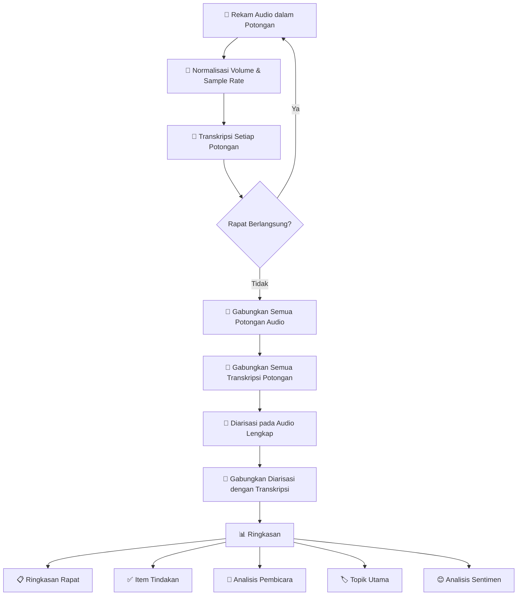
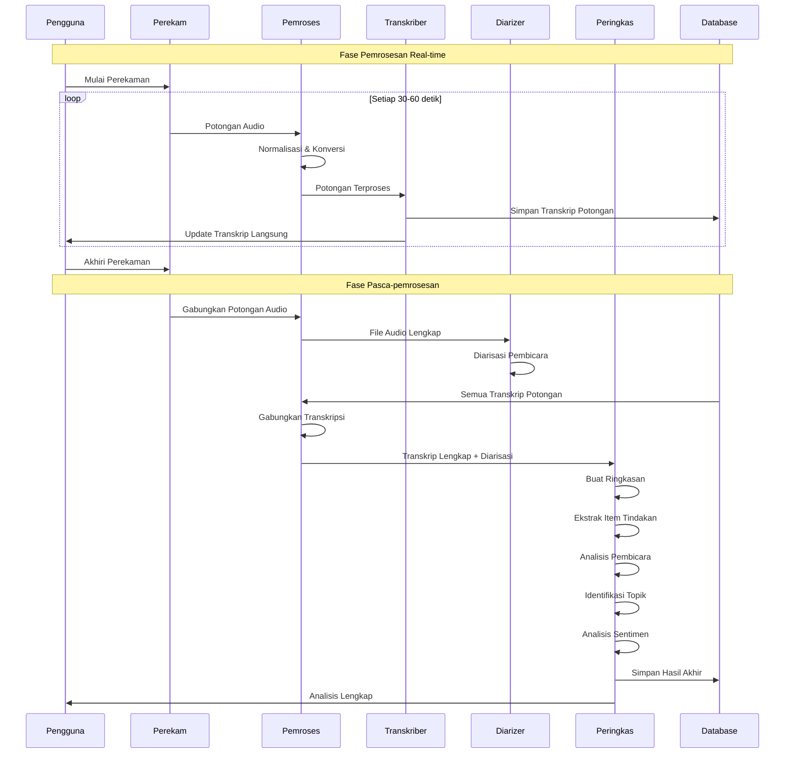
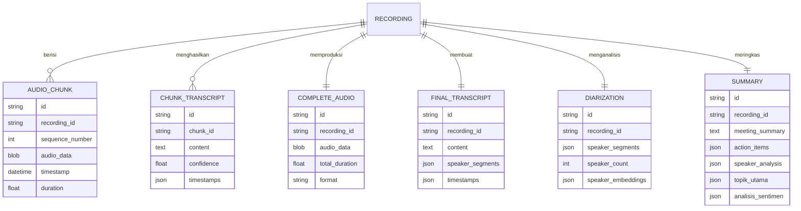

# Alur Kerja Pemrosesan Audio

Dokumen ini menjelaskan alur kerja pemrosesan audio lengkap di Sinopsis, dari merekam potongan audio hingga menghasilkan ringkasan akhir.

## Gambaran Umum

Sistem pemrosesan audio Sinopsis mengikuti alur kerja komprehensif yang menangani perekaman audio real-time, pemrosesan, transkripsi, dan analisis. Sistem ini dirancang untuk memproses audio dalam potongan untuk kinerja yang lebih baik dan kemampuan real-time, kemudian menggabungkan semuanya di akhir untuk analisis final.

## Langkah-langkah Alur Kerja

### 1. Rekam Audio dalam Potongan

- **Tujuan**: Menangkap input audio dalam segmen yang dapat dikelola selama rapat atau percakapan langsung
- **Manfaat**:
  - Memungkinkan pemrosesan real-time
  - Mengurangi penggunaan memori
  - Menyediakan pemulihan kesalahan yang lebih baik
  - Memungkinkan transkripsi streaming
- **Implementasi**: Audio direkam dalam segmen waktu yang dapat dikonfigurasi (biasanya 30-60 detik)

### 2. Normalisasi Volume dan Ubah Sample Rate

- **Tujuan**: Menstandarkan kualitas audio untuk pemrosesan yang konsisten
- **Operasi**:
  - Normalisasi volume untuk mencegah clipping dan memastikan level yang konsisten
  - Konversi sample rate ke rate standar (biasanya 16kHz untuk pengenalan suara)
  - Standardisasi format audio
- **Manfaat**: Meningkatkan akurasi dan konsistensi transkripsi

### 3. Transkripsi Setiap Potongan

- **Tujuan**: Mengonversi suara menjadi teks untuk setiap segmen audio
- **Proses**:
  - Pemrosesan potongan individual untuk hasil yang lebih cepat
  - Transkripsi real-time atau near-real-time
  - Penilaian kepercayaan untuk penilaian kualitas
- **Output**: Segmen teks dengan timestamp dan skor kepercayaan

### 4. Gabungkan Semua Potongan Audio (Setelah Akhir Rapat)

- **Tujuan**: Membuat file audio lengkap untuk pemrosesan final
- **Proses**:
  - Menggabungkan semua potongan audio dalam urutan kronologis
  - Memastikan transisi yang mulus antara potongan
  - Mempertahankan kualitas audio dan akurasi timing
- **Output**: File audio tunggal yang lengkap dari seluruh sesi

### 5. Gabungkan Semua Transkripsi Potongan

- **Tujuan**: Membuat transkrip lengkap dari transkripsi potongan individual
- **Proses**:
  - Menggabungkan transkrip dalam urutan kronologis
  - Menyelesaikan tumpang tindih dan celah antara potongan
  - Mempertahankan konteks pembicara lintas batas potongan
- **Output**: Transkrip lengkap dengan timestamp

### 6. Diarisasi pada Audio Lengkap

- **Tujuan**: Mengidentifikasi dan memisahkan pembicara yang berbeda dalam percakapan
- **Proses**:
  - Menganalisis file audio lengkap untuk karakteristik pembicara
  - Mengidentifikasi perubahan dan segmen pembicara
  - Menetapkan label pembicara (Pembicara 1, Pembicara 2, dll.)
- **Manfaat**: Akurasi yang lebih baik saat memproses audio lengkap vs. potongan individual

### 7. Gabungkan Hasil Diarisasi dengan Transkripsi Lengkap

- **Tujuan**: Menggabungkan identifikasi pembicara dengan teks yang ditranskripsi
- **Proses**:
  - Menyelaraskan timestamp diarisasi dengan timestamp transkripsi
  - Menetapkan label pembicara ke segmen transkrip
  - Menyelesaikan konflik dan meningkatkan akurasi
- **Output**: Transkrip dengan atribusi pembicara dan timestamp

### 8. Ringkasan

- **Tujuan**: Menghasilkan wawasan dan ringkasan yang bermakna dari konten yang diproses
- **Komponen**:
  - **Ringkasan Rapat**: Poin-poin kunci dan keputusan
  - **Item Tindakan**: Tugas dan penugasan yang diidentifikasi
  - **Analisis Pembicara**: Metrik partisipasi dan pola berbicara
  - **Topik Utama**: Tema dan subjek utama yang dibahas
  - **Analisis Sentimen**: Nada emosional dan tingkat keterlibatan

## Diagram Alur Kerja Lengkap

## Alur Proses Detail

## Catatan Implementasi Teknis

### Pemrosesan Potongan

- **Ukuran Potongan**: Dapat dikonfigurasi, biasanya 30-60 detik
- **Tumpang Tindih**: Tumpang tindih kecil antara potongan untuk mencegah pemotongan kata
- **Format**: Terstandarisasi ke WAV/PCM untuk konsistensi pemrosesan

### Normalisasi Audio

- **Volume**: Normalisasi RMS ke rentang -20dB hingga -12dB
- **Sample Rate**: Konversi ke 16kHz untuk pengenalan suara optimal
- **Channel**: Konversi stereo ke mono untuk efisiensi pemrosesan

### Transkripsi

- **Engine**: Dapat dikonfigurasi (Whisper, Google Speech-to-Text, dll.)
- **Bahasa**: Deteksi otomatis atau spesifikasi manual
- **Kepercayaan**: Filtering berbasis threshold untuk jaminan kualitas

### Diarisasi

- **Algoritma**: Clustering berbasis embedding pembicara
- **Segmen Minimum**: 1-2 detik untuk perubahan pembicara
- **Pembicara Maksimum**: Batas yang dapat dikonfigurasi (biasanya 2-10)

### Ringkasan

- **Model**: Large Language Model (GPT, Claude, dll.)
- **Prompt Engineering**: Prompt yang sadar konteks untuk berbagai jenis rapat
- **Format Output**: Markdown terstruktur dengan bagian-bagian

## Aliran Data dan Penyimpanan

## Pertimbangan Kinerja

### Pemrosesan Real-time

- **Latensi**: Target < 5 detik dari suara ke transkrip
- **Throughput**: Mendukung beberapa perekaman bersamaan
- **Penggunaan Resource**: Penggunaan CPU/memori yang seimbang untuk pemrosesan potongan

### Trade-off Kualitas vs Kecepatan

- **Transkripsi Potongan**: Cepat tapi berpotensi kurang akurat
- **Diarisasi Final**: Lebih lambat tapi identifikasi pembicara lebih akurat
- **Ringkasan**: Pemrosesan batch setelah penyelesaian rapat

### Skalabilitas

- **Horizontal Scaling**: Pemrosesan potongan dapat didistribusikan
- **Manajemen Antrian**: Pemrosesan latar belakang untuk tugas non-real-time
- **Optimisasi Penyimpanan**: Penyimpanan audio terkompresi dengan preservasi kualitas

## Penanganan Kesalahan dan Pemulihan

### Kegagalan Level Potongan

- **Strategi Skip**: Lanjut dengan potongan berikutnya jika satu gagal
- **Logika Retry**: Retry otomatis dengan exponential backoff
- **Fallback Kualitas**: Pemrosesan kualitas rendah jika kualitas tinggi gagal

### Kegagalan Pemrosesan Lengkap

- **Hasil Parsial**: Berikan hasil yang tersedia meskipun beberapa langkah gagal
- **Intervensi Manual**: Alert operator untuk kegagalan kritis
- **Pemrosesan Backup**: Pipeline pemrosesan alternatif

## Peningkatan Masa Depan

### Fitur Lanjutan

- **Dukungan Multi-bahasa**: Perpindahan bahasa otomatis dalam sesi
- **Kosakata Kustom**: Pelatihan terminologi spesifik domain
- **Pengenalan Pembicara**: Identifikasi pembicara tertentu yang dikenal
- **Deteksi Emosi**: Analisis sentimen dan emosi lanjutan

### Kemampuan Integrasi

- **Integrasi Kalender**: Import konteks rapat otomatis
- **Integrasi CRM**: Menghubungkan ringkasan ke catatan pelanggan
- **Tools Kolaborasi**: Ekspor ke Slack, Teams, dll.
- **Akses API**: RESTful APIs untuk integrasi pihak ketiga

---

_Alur kerja ini dirancang untuk menyediakan pemrosesan audio yang komprehensif sambil mempertahankan kemampuan real-time dan hasil akhir berkualitas tinggi._
