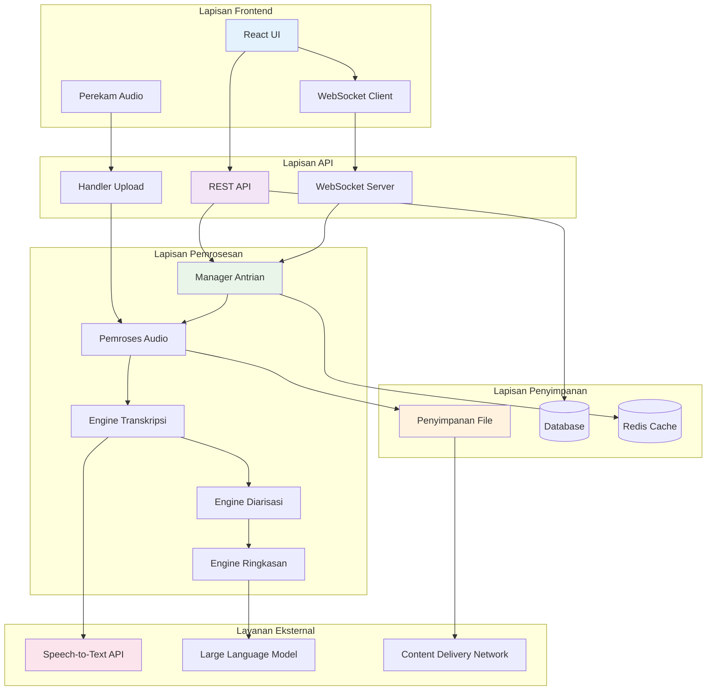
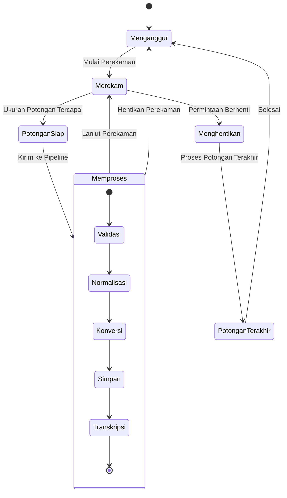
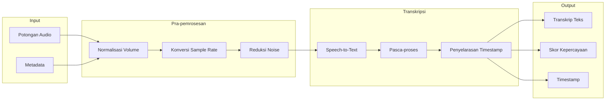
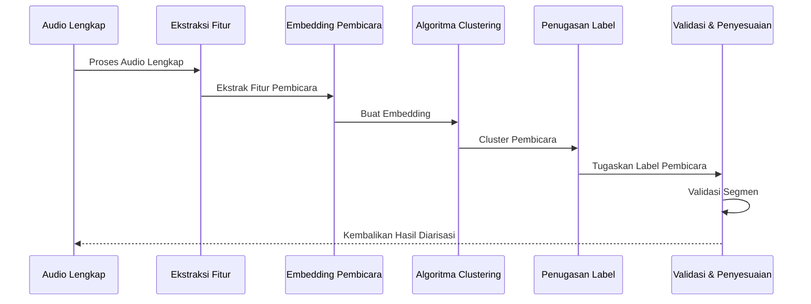
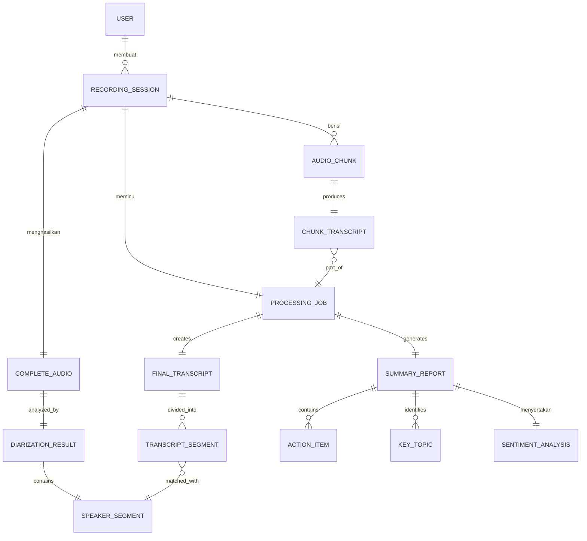
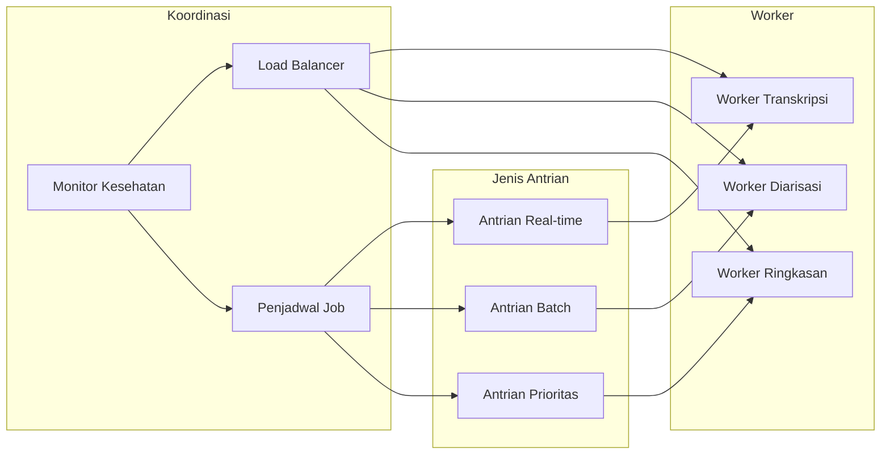

# Arsitektur Teknis - Pipeline Pemrosesan Audio

Dokumen ini menyediakan spesifikasi teknis rinci dan detail implementasi untuk pipeline pemrosesan audio Sinopsis.

## Gambaran Umum Arsitektur Sistem



## Detail Pipeline Pemrosesan

### 1. Pipeline Perekaman Potongan Audio



### 2. Alur Kerja Transkripsi



### 3. Proses Diarisasi



## Model Data dan Skema

### Hubungan Entitas Inti



### Skema Detail

```sql
-- Sesi perekaman inti
CREATE TABLE recording_sessions (
    id UUID PRIMARY KEY,
    user_id UUID NOT NULL,
    title VARCHAR(255),
    description TEXT,
    status VARCHAR(50) NOT NULL, -- 'recording', 'processing', 'completed', 'failed'
    started_at TIMESTAMP NOT NULL,
    ended_at TIMESTAMP,
    total_duration INTEGER, -- detik
    settings JSONB, -- pengaturan dan preferensi perekaman
    created_at TIMESTAMP DEFAULT NOW(),
    updated_at TIMESTAMP DEFAULT NOW()
);

-- Potongan audio individual selama perekaman
CREATE TABLE audio_chunks (
    id UUID PRIMARY KEY,
    session_id UUID REFERENCES recording_sessions(id),
    sequence_number INTEGER NOT NULL,
    filename VARCHAR(255) NOT NULL,
    file_path VARCHAR(500) NOT NULL,
    file_size BIGINT NOT NULL,
    duration REAL NOT NULL, -- detik
    sample_rate INTEGER NOT NULL,
    channels INTEGER NOT NULL,
    format VARCHAR(20) NOT NULL,
    recorded_at TIMESTAMP NOT NULL,
    processed_at TIMESTAMP,
    created_at TIMESTAMP DEFAULT NOW()
);

-- Transkrip untuk potongan individual
CREATE TABLE chunk_transcripts (
    id UUID PRIMARY KEY,
    chunk_id UUID REFERENCES audio_chunks(id),
    content TEXT NOT NULL,
    confidence_score REAL,
    language VARCHAR(10),
    timestamps JSONB, -- timestamp level kata
    processing_metadata JSONB,
    created_at TIMESTAMP DEFAULT NOW()
);

-- File audio lengkap setelah menggabungkan potongan
CREATE TABLE complete_audio_files (
    id UUID PRIMARY KEY,
    session_id UUID REFERENCES recording_sessions(id),
    filename VARCHAR(255) NOT NULL,
    file_path VARCHAR(500) NOT NULL,
    file_size BIGINT NOT NULL,
    total_duration REAL NOT NULL,
    sample_rate INTEGER NOT NULL,
    format VARCHAR(20) NOT NULL,
    created_at TIMESTAMP DEFAULT NOW()
);

-- Diarization results
CREATE TABLE diarization_results (
    id UUID PRIMARY KEY,
    session_id UUID REFERENCES recording_sessions(id),
    speaker_count INTEGER NOT NULL,
    processing_algorithm VARCHAR(100),
    confidence_score REAL,
    metadata JSONB,
    created_at TIMESTAMP DEFAULT NOW()
);

-- Speaker segments from diarization
CREATE TABLE speaker_segments (
    id UUID PRIMARY KEY,
    diarization_id UUID REFERENCES diarization_results(id),
    speaker_label VARCHAR(50) NOT NULL,
    start_time REAL NOT NULL, -- seconds
    end_time REAL NOT NULL, -- seconds
    confidence_score REAL,
    created_at TIMESTAMP DEFAULT NOW()
);

-- Final combined transcript
CREATE TABLE final_transcripts (
    id UUID PRIMARY KEY,
    session_id UUID REFERENCES recording_sessions(id),
    content TEXT NOT NULL,
    language VARCHAR(10),
    word_count INTEGER,
    processing_metadata JSONB,
    created_at TIMESTAMP DEFAULT NOW()
);

-- Transcript segments with speaker attribution
CREATE TABLE transcript_segments (
    id UUID PRIMARY KEY,
    transcript_id UUID REFERENCES final_transcripts(id),
    speaker_segment_id UUID REFERENCES speaker_segments(id),
    content TEXT NOT NULL,
    start_time REAL NOT NULL,
    end_time REAL NOT NULL,
    speaker_label VARCHAR(50),
    confidence_score REAL,
    word_timestamps JSONB,
    created_at TIMESTAMP DEFAULT NOW()
);

-- Summary and analysis results
CREATE TABLE summary_reports (
    id UUID PRIMARY KEY,
    session_id UUID REFERENCES recording_sessions(id),
    summary TEXT NOT NULL,
    key_points JSONB,
    processing_model VARCHAR(100),
    generated_at TIMESTAMP DEFAULT NOW(),
    created_at TIMESTAMP DEFAULT NOW()
);

-- Action items extracted from content
CREATE TABLE action_items (
    id UUID PRIMARY KEY,
    summary_id UUID REFERENCES summary_reports(id),
    description TEXT NOT NULL,
    assignee VARCHAR(255),
    due_date DATE,
    priority VARCHAR(20), -- 'low', 'medium', 'high'
    status VARCHAR(20) DEFAULT 'pending', -- 'pending', 'completed', 'cancelled'
    source_segment_id UUID REFERENCES transcript_segments(id),
    created_at TIMESTAMP DEFAULT NOW()
);

-- Key topics identified
CREATE TABLE key_topics (
    id UUID PRIMARY KEY,
    summary_id UUID REFERENCES summary_reports(id),
    topic VARCHAR(255) NOT NULL,
    relevance_score REAL,
    mentions_count INTEGER,
    first_mentioned_at REAL, -- timestamp in recording
    related_segments JSONB, -- array of segment IDs
    created_at TIMESTAMP DEFAULT NOW()
);

-- Sentiment analysis results
CREATE TABLE sentiment_analyses (
    id UUID PRIMARY KEY,
    summary_id UUID REFERENCES summary_reports(id),
    overall_sentiment VARCHAR(20), -- 'positive', 'negative', 'neutral'
    sentiment_score REAL, -- -1 to 1
    emotional_tone JSONB, -- detailed emotion analysis
    speaker_sentiments JSONB, -- per-speaker sentiment
    sentiment_timeline JSONB, -- sentiment changes over time
    created_at TIMESTAMP DEFAULT NOW()
);

-- Processing jobs for tracking async operations
CREATE TABLE processing_jobs (
    id UUID PRIMARY KEY,
    session_id UUID REFERENCES recording_sessions(id),
    job_type VARCHAR(50) NOT NULL, -- 'transcription', 'diarization', 'summarization'
    status VARCHAR(20) NOT NULL, -- 'pending', 'running', 'completed', 'failed'
    started_at TIMESTAMP,
    completed_at TIMESTAMP,
    error_message TEXT,
    progress_percentage INTEGER DEFAULT 0,
    metadata JSONB,
    created_at TIMESTAMP DEFAULT NOW(),
    updated_at TIMESTAMP DEFAULT NOW()
);
```

## Sistem Antrian Pemrosesan



## Endpoint API

### Manajemen Perekaman

```typescript
// Memulai sesi perekaman baru
POST /api/recordings
{
  "title": "Rapat Tim",
  "description": "Standup mingguan",
  "settings": {
    "chunkDuration": 30,
    "quality": "high",
    "language": "id-ID"
  }
}

// Upload chunk audio
POST /api/recordings/{sessionId}/chunks
Content-Type: multipart/form-data
{
  "audio": File,
  "sequenceNumber": 1,
  "timestamp": "2025-09-19T10:30:00Z"
}

// Mengakhiri sesi perekaman
POST /api/recordings/{sessionId}/complete

// Mendapatkan status sesi
GET /api/recordings/{sessionId}/status

// Mendapatkan transkrip real-time
GET /api/recordings/{sessionId}/transcript/live
```

### Pemrosesan dan Hasil

```typescript
// Mendapatkan transkrip final
GET / api / recordings / { sessionId } / transcript;

// Mendapatkan hasil diarisasi
GET / api / recordings / { sessionId } / diarization;

// Mendapatkan laporan ringkasan
GET / api / recordings / { sessionId } / summary;

// Mendapatkan item tindakan
GET / api / recordings / { sessionId } / action - items;

// Mengunduh audio yang telah diproses
GET / api / recordings / { sessionId } / audio / download;
```

## Manajemen Konfigurasi

```yaml
# config/processing.yml
audio:
  chunk_duration: 30 # detik
  sample_rate: 16000 # Hz
  channels: 1 # mono
  format: "wav"
  volume_normalization: true
  noise_reduction: true

transcription:
  provider: "whisper" # whisper, google, azure
  language: "auto" # deteksi otomatis atau kode bahasa spesifik
  confidence_threshold: 0.7
  real_time_processing: true

diarization:
  min_speakers: 1
  max_speakers: 10
  min_segment_duration: 2.0 # detik
  algorithm: "spectral_clustering"

summarization:
  provider: "openai" # openai, anthropic, local
  model: "gpt-4"
  max_tokens: 2000
  temperature: 0.3
  include_action_items: true
  include_sentiment: true

storage:
  audio_retention_days: 90
  transcript_retention_days: 365
  compression_enabled: true
  cdn_enabled: true

performance:
  max_concurrent_sessions: 50
  worker_pool_size: 10
  queue_max_size: 1000
  processing_timeout: 300 # detik
```

Arsitektur teknis ini menyediakan fondasi komprehensif untuk mengimplementasikan alur kerja pemrosesan audio yang dijelaskan dalam dokumen alur kerja utama.
